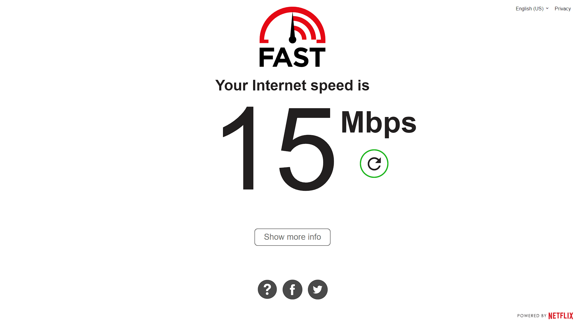
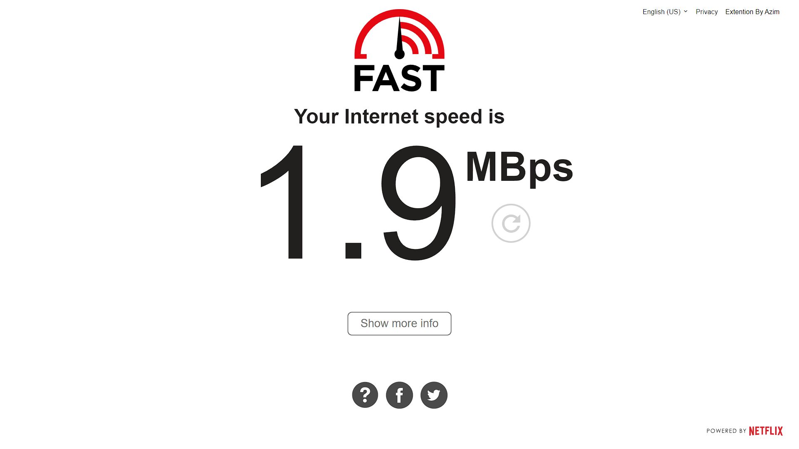

# Fast.com Speed Converter Extension

This Chrome extension for [Fast.com](https://fast.com/) converts internet speed units from Mbps (Megabits per second) to MBps (Megabytes per second) for easier understanding of your internet speed.

> Basically, it tells the actual download speed.

## 📸 Demo

### Without Extension



### With Extension



## 🛠️ Installation

1. Clone the repository or download the zip file.
   ```bash
   git clone <azim>
   ```
   
2. Open Chrome and go to `chrome://extensions/`

3. Enable "Developer mode" by toggling the switch in the top right corner.

4. Click on "Load unpacked" and select the directory where the extension is located.

5. The Fast.com Mbps to MBps Converter Extension should now be installed and active.

6. Go to [Fast.com](https://fast.com/) and enjoy! 

<br/>
<div align= "center">
<h3>Built with 🤍 by Azim</h3>
</div>